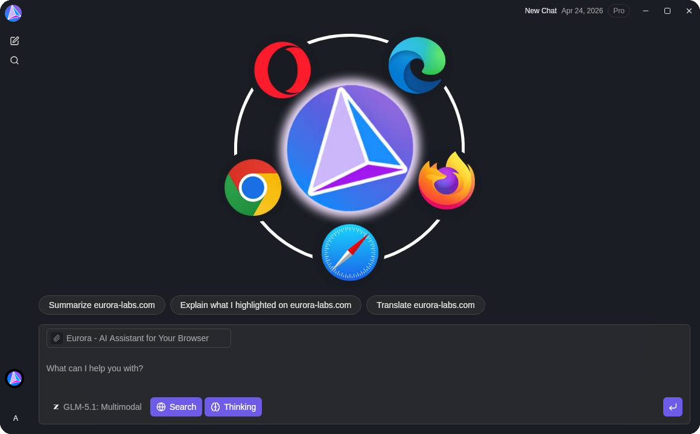
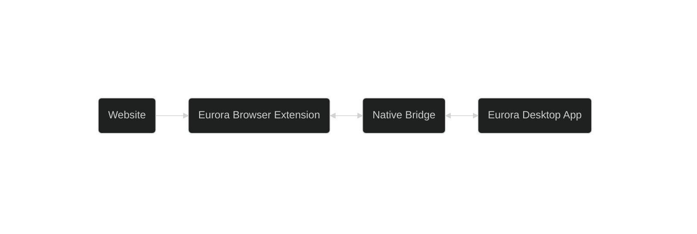

# Eurora

  
  
  
  

Welcome to Eurora, a context aware, cross-platform, fully private and open source AI assistant.

Eurora provides seamless OS integration and makes asking questions much easier. The cloud servers run in The Netherlands and all the data is stored in European Sovereign Data Centers, ensuring full privacy for users all around the world via the highest standards set by the European Union. We have first-party support for local deployment and extensive documentation for running this on your own home server.

We're a community driven project, and we welcome contributions from anyone who is interested in helping us build a better future for AI.

## Use cases

- **General LLM usage**: Eurora is a fully open source equivalent to proprietary companies like OpenAI, Antropic and others. We securely run state-of-the-art models in the cloud so you do not need to compromise on privacy or LLM quality when using AI.
- **Asking without copy pasting**: The app connects to your browser and provides full and seamless integration with every single website in the world, allowing the AI to have full context whenever you ask a question.
- **A single AI that runs everywhere**: Eurora runs on MacOS, Linux and Windows. It works on every browser, and supports every single website. You can use the same AI assistant everywhere without having to pay for different subscriptions and managing your memory.
- **Local dedicated servers**: Our vision for the future is fully local AI server. Eurora server component is meant to run on a separate instance in order to match the proprietary cloud offerings in terms of features while also giving you the benefit of fully local open source AI.

## How it works

Eurora connects directly to your browser. When you ask a question, the AI can pull context from your browser page to instantly give you the correct answer.

The browser extension captures page content (articles, videos, tweets) through content scripts and sends it to the desktop app via a native messaging host. All data stays on your local machine - nothing is sent to external servers passively. You're in full control of what is processed and when.

## Features

- **New way to use AI**: Eurora uses a custom network layer to enable 2-way communication with the browser. Allowing the AI agent to retrieve perfect context any time you ask a question. You never have to explain yourself again.
- **Graph view**: Eurora is made for real work. Graph feature gives you the ability to view the edited messages in your conversation as different paths that can easily be navigated.
- **No compromises**: Eurora is made to match every single proprietary AI 1 to 1 and deliver it to you locally. No drawbacks, no complex setup. Easy to use and user-first, forever.
- **Local deployment**: Easily deploy enterprise grade infrastructure locally to create a 1 to 1 duplicate of the cloud deployment.
- **European AI**: All of the data is stored and processed inside of the European Union, regardless of your location. Allowing everyone to make use of the highest standards of privacy and security.
- **No vendor lock-in**: Eurora is built to be as flexible as possible. You can run all of the code yourself and connect to any provider you might want.
- **Privacy first**: We do not share or sell your data. Everything remains private. What you delete actually gets deleted forever. You don't have to believe our words, you can see it for yourself - every single line is Open Source.

## License

Eurora is [fair-code](https://faircode.io/) distributed under the [Sustainable Use License](https://github.com/eurora-labs/eurora/blob/main/LICENSE-SUL-1.0), with each version re-licensed as [Apache-2.0](https://github.com/eurora-labs/eurora/blob/main/LICENSE-APACHE-2.0) two years after its release.

Our primary goal is to provide the community with a powerful and extensible AI platform that can run on your own home hardware, while rivaling the industry leaders in terms of performance and features.

Main points of Sustainable Use License (SUL) are:

- _Source Available_: Always visible source code
- _Self-Hostable_: Deploy anywhere
- _Extensible_: Add your own plugins and features

## Installation

Please download the version for your platform on https://www.eurora-labs.com/

## Star History

<a href="https://www.star-history.com/?repos=eurora-labs%2Feurora&type=date&legend=top-left">
 <picture>
   <source media="(prefers-color-scheme: dark)" srcset="https://api.star-history.com/chart?repos=eurora-labs/eurora&type=date&theme=dark&legend=top-left" />
   <source media="(prefers-color-scheme: light)" srcset="https://api.star-history.com/chart?repos=eurora-labs/eurora&type=date&legend=top-left" />
   
 </picture>
</a>
