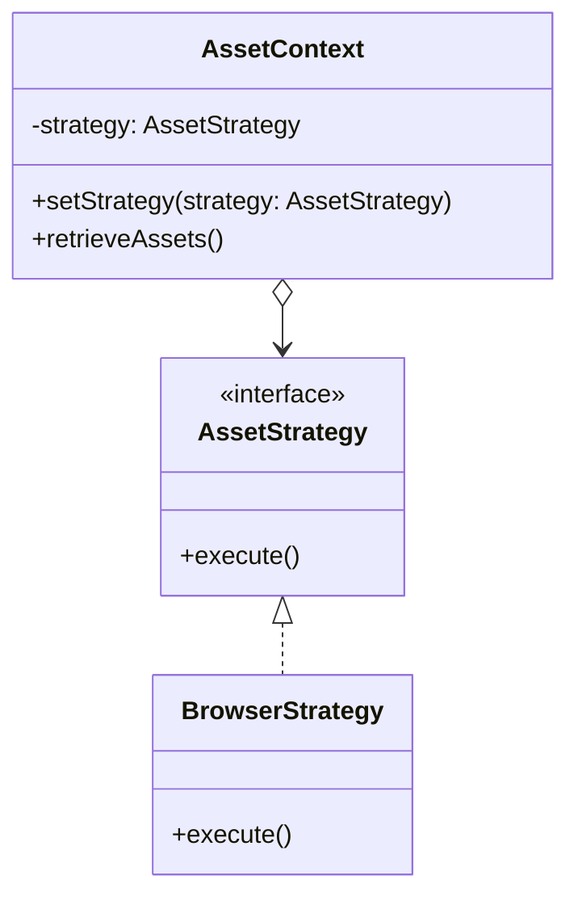

# Asset Strategy Class Diagram

```mermaid
classDiagram
    AssetContext o--> AssetStrategy
    AssetStrategy <|.. BrowserStrategy

    class AssetContext {
        -strategy: AssetStrategy

        +setStrategy(strategy: AssetStrategy)
        +retrieveAssets()
    }

    class AssetStrategy {
        <<interface>>

        +execute()
    }

    class BrowserStrategy {
        +execute()
    }


```
