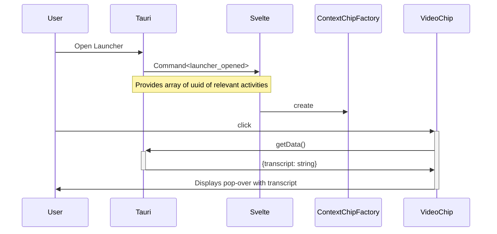

```mermaid
sequenceDiagram
    User->>Tauri: Open Launcher
    Tauri->>Svelte: Command<launcher_opened>
    Note over Tauri,Svelte: Provides array of uuid of relevant activities
    Svelte->>ContextChipFactory: create

    User->>+VideoChip: click

    VideoChip->>+Tauri: getData()
    Tauri->>-VideoChip: {transcript: string}

    VideoChip->>-User: Displays pop-over with transcript
```
