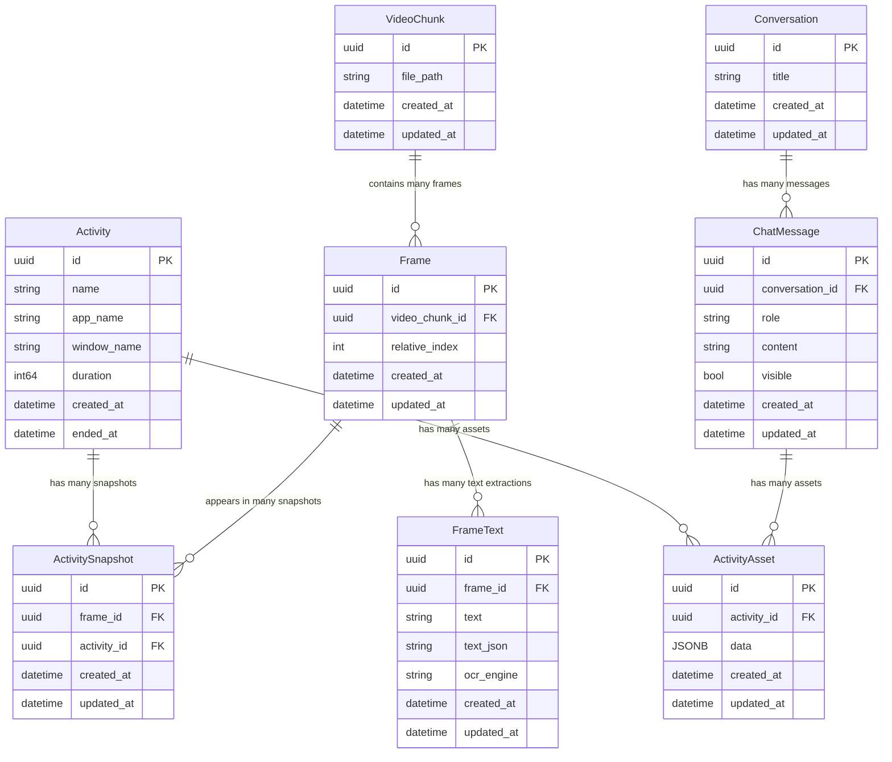

# Eurora SQLite Database Structure

This diagram visualizes the SQLite database schema used by Eurora for storing and managing various data types.

## Entity Relationship Diagram

```mermaid
erDiagram
    Activity ||--o{ ActivityAsset : "has many assets"
    Activity ||--o{ ActivitySnapshot : "has many snapshots"
    Frame ||--o{ ActivitySnapshot : "appears in many snapshots"
    VideoChunk ||--o{ Frame : "contains many frames"
    Frame ||--o{ FrameText : "has many text extractions"
    Conversation ||--o{ ChatMessage : "has many messages"
    ChatMessage ||--o{ ActivityAsset : "has many assets"

    Conversation {
        uuid id PK
        string title

        datetime created_at
        datetime updated_at
    }

    ChatMessage {
        uuid id PK
        uuid conversation_id FK
        string role
        string content
        %% Messages compiled from assets and snapshots are hidden
        bool visible

        datetime created_at
        datetime updated_at
    }

    %% Table for tracking each individual Activity. Can be different apps, different tabs or even more granular domain sub url activities (e.g. Youtube ?watch id's)
    Activity {
        uuid id PK
        string name
        string app_name
        string window_name
        int64 duration

        datetime created_at
        datetime ended_at
    }

    %% Table for references to heavier prompt helpers that don't need to be collected regularly
    ActivityAsset {
        uuid id PK
        uuid activity_id FK
        JSONB data

        datetime created_at
        datetime updated_at
    }

    ActivitySnapshot {
        uuid id PK
        uuid frame_id FK
        uuid activity_id FK

        datetime created_at
        datetime updated_at
    }

    VideoChunk {
        uuid id PK
        string file_path

        datetime created_at
        datetime updated_at
    }

    Frame {
        uuid id PK
        uuid video_chunk_id FK
        int relative_index

        datetime created_at
        datetime updated_at
    }

    FrameText {
        uuid id PK
        uuid frame_id FK

        string text
        string text_json
        string ocr_engine

        datetime created_at
        datetime updated_at
    }

```
