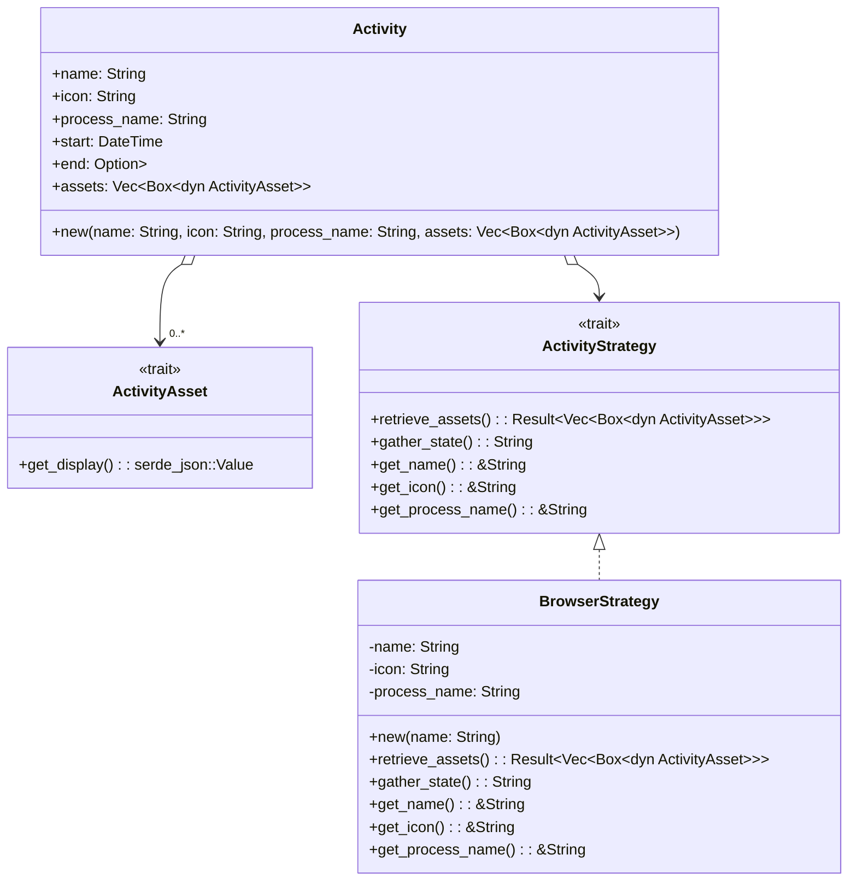

# Activity Strategy Class Diagram

```mermaid
classDiagram
    Activity o--> "0..*" ActivityAsset
    Activity o--> ActivityStrategy
    ActivityStrategy <|.. BrowserStrategy

    class Activity {
        +name: String
        +icon: String
        +process_name: String
        +start: DateTime<Utc>
        +end: Option<DateTime<Utc>>
        +assets: Vec&lt;Box&lt;dyn ActivityAsset>>
        
        +new(name: String, icon: String, process_name: String, assets: Vec&lt;Box&lt;dyn ActivityAsset>>)
    }

    class ActivityAsset {
        <<trait>>
        +get_display(): serde_json::Value
    }

    class ActivityStrategy {
        <<trait>>
        +retrieve_assets(): Result&lt;Vec&lt;Box&lt;dyn ActivityAsset>>>
        +gather_state(): String
        +get_name(): &String
        +get_icon(): &String
        +get_process_name(): &String
    }

    class BrowserStrategy {
        -name: String
        -icon: String
        -process_name: String
        
        +new(name: String)
        +retrieve_assets(): Result&lt;Vec&lt;Box&lt;dyn ActivityAsset>>>
        +gather_state(): String
        +get_name(): &String
        +get_icon(): &String
        +get_process_name(): &String
    }
```
