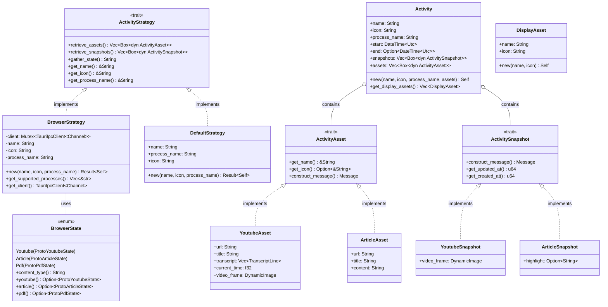

# Activity Strategy Class Diagram



# Activity Sequence Diagram

```mermaid
sequenceDiagram
    participant Client
    participant StrategySelector as select_strategy_for_process()
    participant BrowserStrategy
    participant DefaultStrategy
    participant NativeMessaging as Native Messaging
    participant Activity
    
    Client->>StrategySelector: select_strategy_for_process(process_name, display_name, icon)
    
    alt is browser process
        StrategySelector->>BrowserStrategy: new(name, icon, process_name)
        BrowserStrategy->>NativeMessaging: create_grpc_ipc_client()
        NativeMessaging-->>BrowserStrategy: TauriIpcClient
        StrategySelector-->>Client: Box<dyn ActivityStrategy>
    else is not browser process
        StrategySelector->>DefaultStrategy: new(name, icon, process_name)
        DefaultStrategy-->>StrategySelector: DefaultStrategy
        StrategySelector-->>Client: Box<dyn ActivityStrategy>
    end
    
    Client->>+BrowserStrategy: retrieve_assets()
    BrowserStrategy->>+NativeMessaging: get_state()
    NativeMessaging-->>-BrowserStrategy: StateResponse
    
    alt YouTube content
        BrowserStrategy->>BrowserStrategy: Create YoutubeAsset
    else Article content
        BrowserStrategy->>BrowserStrategy: Create ArticleAsset
    else PDF content
        BrowserStrategy->>BrowserStrategy: (Not implemented)
    end
    
    BrowserStrategy-->>-Client: Vec<Box<dyn ActivityAsset>>
    
    Client->>+BrowserStrategy: retrieve_snapshots()
    BrowserStrategy->>+NativeMessaging: get_snapshot()
    NativeMessaging-->>-BrowserStrategy: SnapshotResponse
    
    alt YouTube content
        BrowserStrategy->>BrowserStrategy: Create YoutubeSnapshot
    else Article content
        BrowserStrategy->>BrowserStrategy: Create ArticleSnapshot
    end
    
    BrowserStrategy-->>-Client: Vec<Box<dyn ActivitySnapshot>>
    
    Client->>Activity: new(name, icon, process_name, assets)
    Client->>Activity: Add snapshots
    
    Note over Client,Activity: Activity now contains all assets and snapshots
