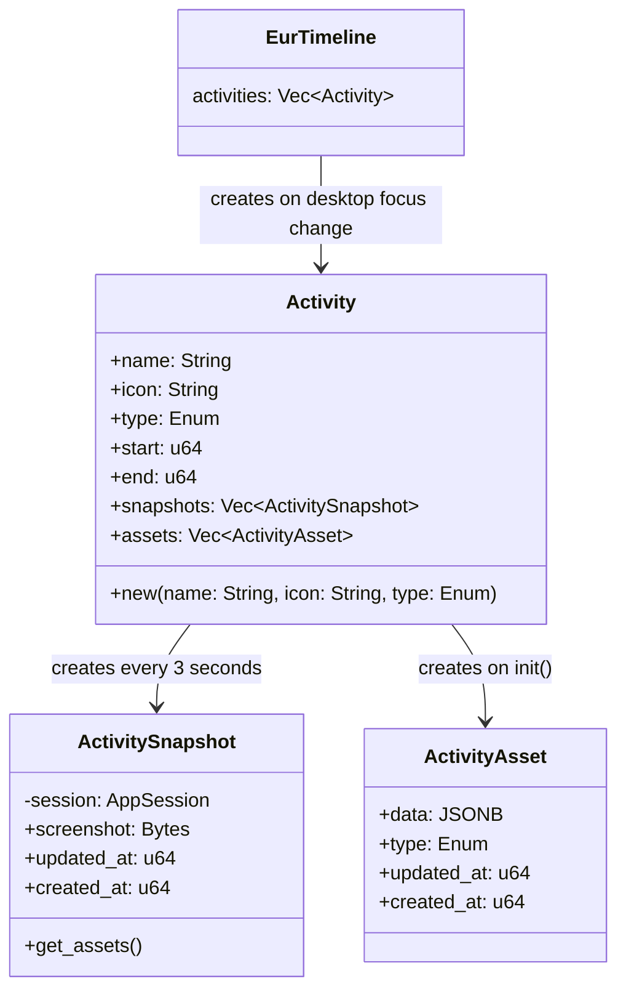

```mermaid
classDiagram
    class EurTimeline {
        activities: Vec&lt;Activity>
    }

    class Activity {
        +name: String
        +icon: String
        +type: Enum
        +start: u64
        +end: u64
        +snapshots: Vec&lt;ActivitySnapshot>
        +assets: Vec&lt;ActivityAsset>

        +new(name: String, icon: String, type: Enum)

    }

    class ActivitySnapshot {
        -session: AppSession
        +screenshot: Bytes
        +updated_at: u64
        +created_at: u64

        +get_assets()
    }

    class ActivityAsset {
        +data: JSONB
        +type: Enum
        +updated_at: u64
        +created_at: u64
    }

    EurTimeline --> Activity: creates on desktop focus change
    Activity --> ActivitySnapshot: creates every 3 seconds
    Activity --> ActivityAsset: creates on init()


```
