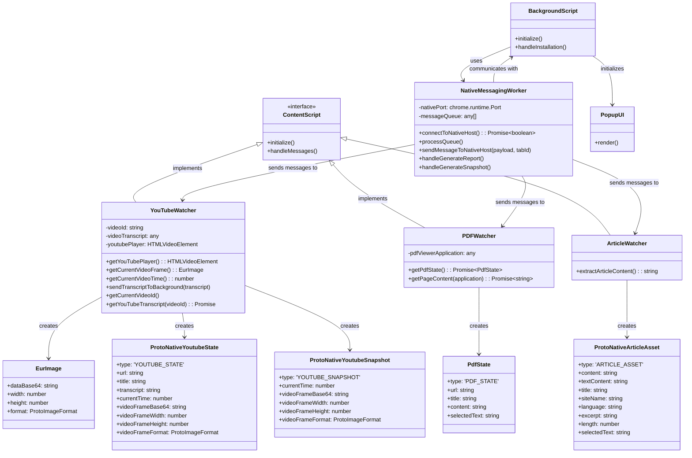
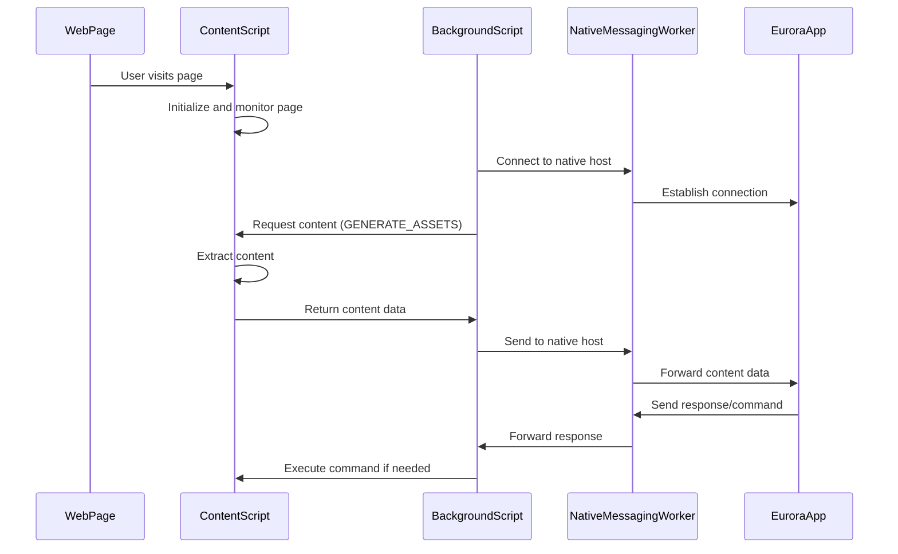

# Eurora Extension Architecture

The Eurora browser extension is designed to capture and process content from various web pages, including YouTube videos, PDF documents, and general articles. It communicates with the native Eurora application through Chrome's native messaging API.

## Class Diagram

## Component Structure

The extension is organized into three main components:

1. **Background Script**: Manages the extension lifecycle and coordinates communication between content scripts and the native application.

2. **Content Scripts**: Specialized scripts that run in the context of web pages to extract content:
    - **YouTube Watcher**: Extracts video information, transcripts, and captures frames from YouTube videos
    - **PDF Watcher**: Extracts content from PDF documents viewed in the browser
    - **Article Watcher**: Uses Mozilla's Readability library to extract clean content from article pages

3. **Popup UI**: Provides a user interface for the extension, showing the Eurora logo and links to the website and GitHub repository.

## Communication Flow

This architecture allows the extension to seamlessly integrate with the Eurora desktop application, providing a bridge between web content and the AI-powered features of Eurora.
