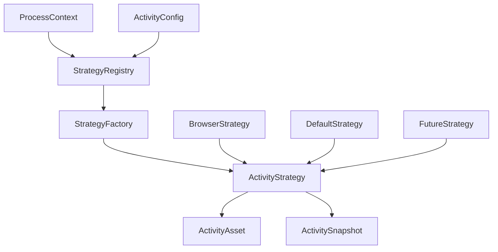

# EUR Activity - Extensible Activity Collection System

A flexible, extensible system for collecting activity data from various applications to reconstruct user workflows.

## Overview

The `eur-activity` crate provides a plugin-like architecture for collecting activity data from different applications. It uses a strategy pattern with dynamic registration to support various application types while maintaining extensibility for future additions.

## Architecture

### Core Components



### Key Traits

- **`ActivityStrategy`**: Core trait for collecting activity data from applications
- **`StrategyFactory`**: Factory pattern for creating strategy instances
- **`ActivityAsset`**: Represents contextual data (documents, videos, etc.)
- **`ActivitySnapshot`**: Represents temporal state captures

## Current Implementations

### Browser Strategy
Collects data from web browsers including:
- YouTube videos with transcripts
- Articles and web content
- Twitter/social media content
- PDF documents

### Default Strategy
Fallback strategy for unsupported applications that provides basic metadata collection.

## Usage

### Basic Usage

```rust
use eur_activity::{select_strategy_for_process, ProcessContext};
use ferrous_focus::IconData;

#[tokio::main]
async fn main() -> Result<(), Box<dyn std::error::Error>> {
    // Select strategy for a process
    let strategy = select_strategy_for_process(
        "firefox",
        "Firefox Browser".to_string(),
        IconData::default(),
    ).await?;
    
    // Collect assets
    let mut strategy = strategy;
    let assets = strategy.retrieve_assets().await?;
    
    // Collect snapshots
    let snapshots = strategy.retrieve_snapshots().await?;
    
    Ok(())
}
```

### Advanced Configuration

```rust
use eur_activity::{
    ActivityConfigBuilder, StrategyConfig, SnapshotFrequency,
    get_registry, ProcessContext,
};
use std::time::Duration;

#[tokio::main]
async fn main() -> Result<(), Box<dyn std::error::Error>> {
    // Create custom configuration
    let config = ActivityConfigBuilder::new()
        .enable_collection(true)
        .default_collection_interval(Duration::from_secs(5))
        .max_assets_per_activity(15)
        .collect_content(true)
        .configure_strategy(
            "browser".to_string(),
            StrategyConfig {
                enabled: true,
                priority: 90,
                collection_interval: Duration::from_secs(3),
                asset_types: vec!["youtube".to_string(), "article".to_string()],
                snapshot_frequency: SnapshotFrequency::Interval(Duration::from_secs(10)),
                settings: std::collections::HashMap::new(),
            },
        )
        .build();
    
    // Use registry directly for more control
    let registry = get_registry();
    let mut registry_guard = registry.lock().await;
    
    let context = ProcessContext::new(
        "chrome".to_string(),
        "Google Chrome".to_string(),
        IconData::default(),
    );
    
    let strategy = registry_guard.select_strategy(&context).await?;
    
    Ok(())
}
```

## Extending the System

### Adding a New Strategy

1. **Implement the ActivityStrategy trait**:

```rust
use eur_activity::{ActivityStrategy, ActivityAsset, ActivitySnapshot};
use async_trait::async_trait;
use anyhow::Result;

pub struct VSCodeStrategy {
    name: String,
    process_name: String,
    // ... other fields
}

#[async_trait]
impl ActivityStrategy for VSCodeStrategy {
    async fn retrieve_assets(&mut self) -> Result<Vec<Box<dyn ActivityAsset>>> {
        // Collect open files, project context, etc.
        Ok(vec![])
    }
    
    async fn retrieve_snapshots(&mut self) -> Result<Vec<Box<dyn ActivitySnapshot>>> {
        // Collect cursor position, active file, git status, etc.
        Ok(vec![])
    }
    
    fn gather_state(&self) -> String {
        // Return current state as string
        String::new()
    }
    
    fn get_name(&self) -> &String { &self.name }
    fn get_icon(&self) -> &String { &self.name }
    fn get_process_name(&self) -> &String { &self.process_name }
}
```

2. **Create a StrategyFactory**:

```rust
use eur_activity::{
    StrategyFactory, ProcessContext, MatchScore, StrategyMetadata, StrategyCategory
};

pub struct VSCodeStrategyFactory;

#[async_trait]
impl StrategyFactory for VSCodeStrategyFactory {
    async fn create_strategy(&self, context: &ProcessContext) -> Result<Box<dyn ActivityStrategy>> {
        Ok(Box::new(VSCodeStrategy::new(context)?))
    }
    
    fn supports_process(&self, process_name: &str, _: Option<&str>) -> MatchScore {
        if process_name.contains("code") || process_name.contains("vscode") {
            MatchScore::HIGH
        } else {
            MatchScore::NO_MATCH
        }
    }
    
    fn get_metadata(&self) -> StrategyMetadata {
        StrategyMetadata {
            id: "vscode".to_string(),
            name: "VS Code Strategy".to_string(),
            version: "1.0.0".to_string(),
            description: "Collects activity from Visual Studio Code".to_string(),
            supported_processes: vec!["code".to_string(), "vscode".to_string()],
            category: StrategyCategory::Development,
        }
    }
}
```

3. **Register the factory**:

```rust
use eur_activity::get_registry;
use std::sync::Arc;

#[tokio::main]
async fn main() -> Result<(), Box<dyn std::error::Error>> {
    let registry = get_registry();
    let mut registry_guard = registry.lock().await;
    
    registry_guard.register_factory(Arc::new(VSCodeStrategyFactory::new()));
    
    Ok(())
}
```

### Custom Asset Types

```rust
use eur_activity::{ActivityAsset, ContextChip};
use ferrous_llm_core::Message;
use serde::{Serialize, Deserialize};

#[derive(Serialize, Deserialize)]
pub struct CodeFileAsset {
    pub file_path: String,
    pub language: String,
    pub content_preview: String,
    pub git_context: Option<String>,
}

impl ActivityAsset for CodeFileAsset {
    fn get_name(&self) -> &String {
        &self.file_path
    }
    
    fn get_icon(&self) -> Option<&String> {
        None
    }
    
    fn construct_message(&self) -> Message {
        // Create LLM message with code context
        Message::new(/* ... */)
    }
    
    fn get_context_chip(&self) -> Option<ContextChip> {
        Some(ContextChip {
            id: self.file_path.clone(),
            name: "code-file".to_string(),
            extension_id: "vscode-extension-id".to_string(),
            attrs: std::collections::HashMap::new(),
            icon: None,
            position: Some(0),
        })
    }
}
```

## Configuration System

### Global Configuration

```rust
use eur_activity::{ActivityConfig, GlobalConfig, PrivacyConfig};

let config = ActivityConfig {
    global: GlobalConfig {
        enabled: true,
        default_collection_interval: Duration::from_secs(3),
        max_assets_per_activity: 10,
        max_snapshots_per_activity: 100,
        privacy: PrivacyConfig {
            collect_content: true,
            anonymize_data: false,
            exclude_patterns: vec![
                r"password".to_string(),
                r"secret".to_string(),
            ],
            ignored_applications: vec!["sensitive-app".to_string()],
        },
    },
    strategies: HashMap::new(),
    applications: HashMap::new(),
};
```

### Strategy-Specific Configuration

```rust
use eur_activity::{StrategyConfig, SnapshotFrequency};

let browser_config = StrategyConfig {
    enabled: true,
    priority: 80,
    collection_interval: Duration::from_secs(3),
    asset_types: vec![
        "youtube".to_string(),
        "article".to_string(),
        "twitter".to_string(),
    ],
    snapshot_frequency: SnapshotFrequency::Interval(Duration::from_secs(5)),
    settings: HashMap::new(),
};
```

## Privacy and Security

The system includes comprehensive privacy controls:

- **Content Collection Control**: Choose between full content or metadata-only collection
- **Data Anonymization**: Automatic anonymization of sensitive data
- **Pattern Exclusion**: Regex patterns to exclude sensitive information
- **Application Ignoring**: Completely ignore specific applications
- **Per-Application Overrides**: Custom privacy settings per application

## Integration with Timeline

The activity system integrates seamlessly with `eur-timeline`:

```rust
use eur_timeline::TimelineManager;
use eur_activity::select_strategy_for_process;

#[tokio::main]
async fn main() -> Result<(), Box<dyn std::error::Error>> {
    let mut timeline = TimelineManager::new();
    timeline.start().await?;
    
    // The timeline automatically uses the activity system
    // to collect data from focused applications
    
    Ok(())
}
```

## Future Extensions

The architecture is designed to support:

### Planned Strategies
- **IDE Strategies**: VS Code, IntelliJ IDEA, Vim/Neovim
- **Communication Strategies**: Slack, Discord, Microsoft Teams
- **Productivity Strategies**: Notion, Obsidian, Roam Research
- **Design Strategies**: Figma, Adobe Creative Suite
- **Terminal Strategies**: Command line activity tracking
- **Media Strategies**: Spotify, VLC, other media players

### Advanced Features
- **Workflow Reconstruction**: Automatic detection of task boundaries and workflows
- **Context Linking**: Intelligent linking between related activities
- **Semantic Analysis**: Understanding of activity content and relationships
- **Plugin System**: Dynamic loading of strategy plugins
- **Cross-Platform Support**: Platform-specific optimizations

## Examples

Run the comprehensive example:

```bash
cargo run --example extensible_activity_system
```

This example demonstrates:
- Registry initialization
- Configuration system usage
- Strategy selection for different processes
- Framework for future extensions

## Testing

Run the test suite:

```bash
cargo test
```

The tests cover:
- Strategy registry functionality
- Factory pattern implementation
- Configuration validation
- Browser strategy specifics
- Error handling

## Contributing

When adding new strategies:

1. Follow the established patterns
2. Add comprehensive tests
3. Update documentation
4. Consider privacy implications
5. Ensure cross-platform compatibility

## License

This crate is part of the Eurora project and follows the same licensing terms.