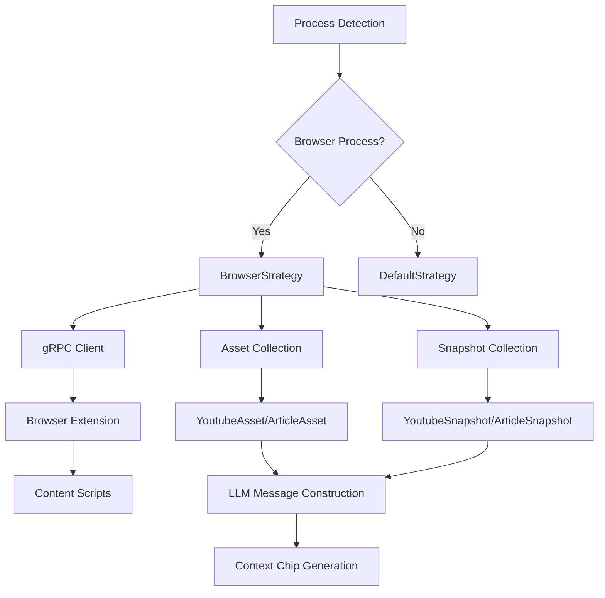

# Architecture Overview - eur-activity Crate

## Purpose
The `eur-activity` crate provides functionality for tracking and reporting user activities within the Eurora application. It serves as a timeline storage system for capturing system state over time, with specialized support for browser-based activities.

## Core Components

### 1. Activity System
The activity system is built around several key traits and structures:

#### [`Activity`](../src/lib.rs:60) Struct
- **Purpose:** Represents a single user activity with associated metadata
- **Key Fields:**
  - `name`: Human-readable activity name
  - `icon`: Base64-encoded icon data
  - `process_name`: System process associated with the activity
  - `start`/`end`: Temporal boundaries using `DateTime<Utc>`
  - `assets`: Collection of activity-related assets
  - `snapshots`: Time-based snapshots of activity state

#### [`ActivityStrategy`](../src/lib.rs:171) Trait
- **Purpose:** Strategy pattern for handling different types of activities
- **Key Methods:**
  - [`retrieve_assets()`](../src/lib.rs:176): Gather initial activity assets
  - [`retrieve_snapshots()`](../src/lib.rs:183): Capture periodic state snapshots
  - [`gather_state()`](../src/lib.rs:190): Collect current activity state

#### [`ActivityAsset`](../src/lib.rs:43) Trait
- **Purpose:** Represents resources associated with an activity
- **Key Methods:**
  - [`construct_message()`](../src/lib.rs:47): Convert asset to LLM message format
  - [`get_context_chip()`](../src/lib.rs:48): Generate UI context chip representation

#### [`ActivitySnapshot`](../src/lib.rs:53) Trait
- **Purpose:** Captures point-in-time state of an activity
- **Key Methods:**
  - [`construct_message()`](../src/lib.rs:54): Convert snapshot to LLM message format
  - [`get_updated_at()`](../src/lib.rs:56)/[`get_created_at()`](../src/lib.rs:57): Timestamp accessors

### 2. Strategy Implementations

#### [`BrowserStrategy`](../src/browser_activity.rs:287)
- **Purpose:** Handles browser-based activities (YouTube, articles, PDFs)
- **Supported Browsers:** Firefox, Chrome, Chromium, Brave, Opera, Vivaldi, Edge, Safari
- **Communication:** Uses gRPC via [`TauriIpcClient`](../src/browser_activity.rs:288) for browser extension communication
- **Asset Types:**
  - [`YoutubeAsset`](../src/browser_activity.rs:24): Video transcripts and frames
  - [`ArticleAsset`](../src/browser_activity.rs:32): Article content and metadata

#### [`DefaultStrategy`](../src/default_activity.rs:5)
- **Purpose:** Fallback strategy for unsupported process types
- **Behavior:** Returns empty assets and snapshots

### 3. Data Flow Architecture

### 4. Integration Points

#### gRPC Communication
- **Client:** [`TauriIpcClient<Channel>`](../src/browser_activity.rs:288)
- **Requests:** [`StateRequest`](../src/browser_activity.rs:340) for asset collection
- **Responses:** Protocol buffer messages containing browser state

#### LLM Integration
- **Message Construction:** Assets and snapshots convert to [`LLMMessage`](../src/lib.rs:47) format
- **Content Types:** Text content for articles, image content for videos
- **Role:** Always uses `Role::User` for activity-generated messages

#### UI Integration
- **Context Chips:** [`ContextChip`](../src/lib.rs:22) structures for UI representation
- **Display Assets:** [`DisplayAsset`](../src/lib.rs:31) for simplified UI display
- **TauRPC:** Uses `#[taurpc::ipc_type]` for frontend communication

## Key Design Patterns

### 1. Strategy Pattern
The crate uses the strategy pattern to handle different activity types:
- [`select_strategy_for_process()`](../src/lib.rs:135) function selects appropriate strategy
- Each strategy implements the [`ActivityStrategy`](../src/lib.rs:171) trait
- Allows for easy extension with new activity types

### 2. Trait-Based Architecture
- [`ActivityAsset`](../src/lib.rs:43) and [`ActivitySnapshot`](../src/lib.rs:53) traits enable polymorphism
- Type erasure using `Box<dyn Trait>` for collections
- Enables different asset types within the same activity

### 3. Protocol Buffer Integration
- Uses [`eur-proto`](../Cargo.toml:9) crate for cross-process communication
- Converts protocol buffer types to internal representations
- Handles multiple image formats (PNG, JPEG, WebP)

## Dependencies and External Integrations

### Core Dependencies
- **[`eur-proto`](../Cargo.toml:9):** Protocol buffer definitions for IPC
- **[`eur-native-messaging`](../Cargo.toml:10):** Browser extension communication
- **[`eur-prompt-kit`](../Cargo.toml:22):** LLM message construction
- **[`chrono`](../Cargo.toml:13):** Timestamp handling with serde support
- **[`image`](../Cargo.toml:12):** Image processing and format handling

### Communication Stack
- **gRPC:** For browser extension communication
- **TauRPC:** For frontend-backend communication
- **Protocol Buffers:** For structured data exchange

## Current Limitations

### 1. Incomplete Implementation
- Several methods contain `todo!()` placeholders
- Missing timestamp implementation in snapshots
- Incomplete state gathering functionality

### 2. Error Handling
- Extensive use of `expect()` and `unwrap()` calls
- Limited graceful degradation on failures
- No timeout handling for network operations

### 3. Asset Processing
- Extension IDs are intentionally hardcoded for asset processing pipeline identification
- Need better documentation of asset type to processing system mapping
- Fixed asset naming conventions could be more descriptive

### 4. Performance
- No image compression or size limits
- Potential memory issues with large video frames
- Synchronous image processing

## Future Enhancements

### 1. Robustness
- Implement proper error handling throughout
- Add timeout and retry mechanisms
- Implement graceful degradation strategies

### 2. Performance
- Add image compression and caching
- Implement lazy loading for large assets
- Add memory usage monitoring

### 3. Extensibility
- Plugin architecture for new activity types
- Dynamic strategy registration
- Asset type registry for processing pipeline management

### 4. Monitoring
- Add metrics collection for activity tracking
- Implement health checks for external dependencies
- Add logging and debugging capabilities

## Testing Strategy

### Unit Testing
- Test each strategy implementation independently
- Mock gRPC clients for isolated testing
- Test trait implementations with various data types

### Integration Testing
- Test end-to-end activity collection flows
- Verify browser extension communication
- Test protocol buffer serialization/deserialization

### Performance Testing
- Memory usage with large images and transcripts
- Concurrent activity collection scenarios
- Network timeout and failure scenarios

## Conclusion
The `eur-activity` crate provides a solid foundation for activity tracking with a well-designed architecture using strategy and trait patterns. However, it requires significant implementation work to be production-ready, particularly in error handling, configuration management, and performance optimization.